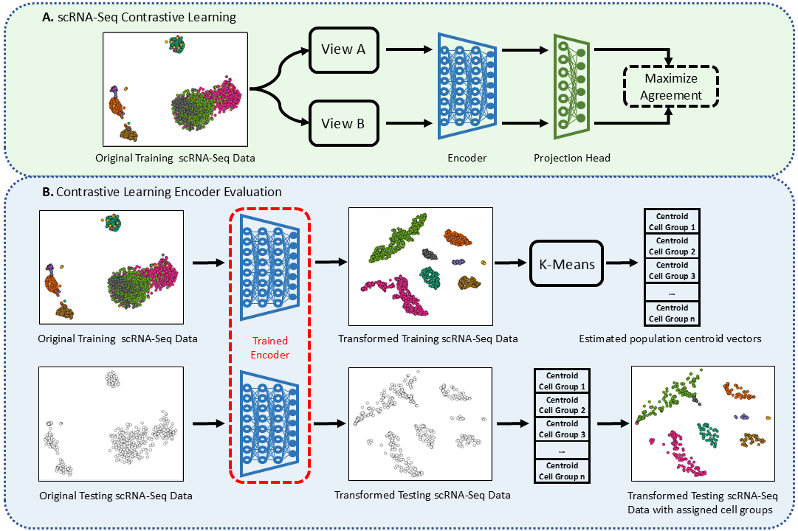

# An extensive evaluation of single-cell RNA-Seq contrastive learning generative networks for intrinsic cell types distribution estimation
This is a python implementation of the **scRCL-G** framework that evaluates the performance of scRNA-Seq contrastive learning generative encoder networks in terms of their performance on learning the intrinsic distributions of different cell types.
```
@article{...,
  title={An extensive evaluation of single-cell RNA-Seq contrastive learning generative networks for intrinsic cell types distribution estimation},
  author={Alsaggaf, Ibrahim and Buchan, Daniel and Wan, Cen},
  journal={...},
  pages={...},
  year={...},
  publisher={...},
  note={Under review}
}
```

<p align="center">
  
</p>


# Usage
This repository contains the implementation of the **scRCL-G** framework. The implementation is built in Python3 (version 3.10.12) using Scikit-learn and the deep learning library Pytorch. 

## Requirements
- torch==2.1.1
- scikit-learn==1.4.0

## Tutorial
To run this implementation you need to do the following steps:
1. Make sure all the requirements stated above are installed.
2. Navigate to your working directory where the `.py` files, dataset, and pretrained encoders are stored (e.g. src).
3. Execute the following command:

```
python3 main.py\
 --X [the full path to file X (i.e. genes expression matrix]\
 --y [the full path to file y (i.e. cell types annotations)]\
 --name [the dataset name]\
 --eval [the evaluation approach. Please enter one of the following options: distributions or centroids]\
 --method [the method name. Please enter one of the following methods: Sup-GsRCL, Sup-RGMRCL-5000, Self-GsRCL, or Self-RGMRCL-3000]\
 --metric [the evaluation metric used for model selection. Please enter one of the following metrics: ari or nmi]\
 --train_size 0.8\
 --cv 5\
 --seed 1111\
 --enc_path [the path where the pretrained encoder is saved]\
 --res_path [the path where the results will be saved]\
```

### Examples
To estimate population distributions of the **Adam** cell types using the method **Sup-GsRCL** and **ARI** as the main metric for model selection execute:
```
python3 main.py\
 --X Adam.csv\
 --y Adam_cell_types.csv\
 --name Adam\
 --eval distributions\
 --method Sup-GsRCL\
 --metric ari\
 --train_size 0.8\
 --cv 5\
 --seed 1111\
 --enc_path .\
 --res_path [the path where the results will be saved]\
```

To estimate population centroids of the **Xin** cell types using the method **Self-GsRCL** and **NMI** as the main metric for model selection execute:
```
python3 main.py\
 --X Xin.csv\
 --y Xin_cell_types.csv\
 --name Xin\
 --eval centroids\
 --method Self-GsRCL\
 --metric nmi\
 --train_size 0.8\
 --cv 5\
 --seed 1111\
 --enc_path .\
 --res_path [the path where the results will be saved]\
```

### The code
Here we briefly describe each `.py` file in the **code** folder.

`main.py` Runs the selected method and saves a **CSV** file containing the results.

`data.py` Reads and preprocesses the given dataset.

`networks.py` Includes the encoder architecture.

`utils.py` and `h5.py` Includes some helper functions.

# Availability
The single-cell RNA-Seq datasets (i.e. genes experssion matrices) used in this work can be downloaded from [](https://doi.org/10.5281/zenodo.8087611). The cell-type annotations for those datasets can be downloaded from [Cell-type annotations](https://github.com/ibrahimsaggaf/AFRCL/tree/main/Cell-type%20annotations). The pre-trained encoders can be downloaded from ...

# Acknowledgements
The authors acknowledge the support by the School of Computing and Mathematical Sciences and the Birkbeck GTA programme.

